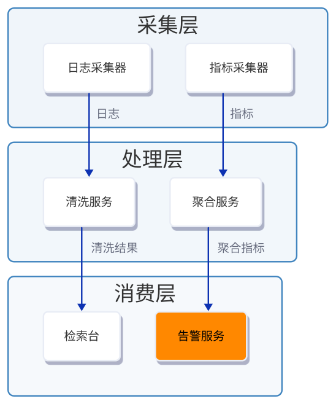

# 错误 soft 网格的协作示例

这是公开合成需求的真实联合生成记录。后端须先声明联合生成 v2；示例不代表现网已升级。没有传入 authoring 模型或历史 D2。

原文要求采集、处理、消费三层，每层两个业务节点在同一行；日志和指标分别沿自己的链路传递，告警服务橙色高亮。用户侧故意建议每层三列，并把每层两列的明确要求交为 hard 规则。

- [完整原文与宏观交接](soft-grid.intent.json)：可作为 `--outline_file` 输入；未枚举全部叶子 D2 或全部物理边。
- [后端生成的完整 D2](soft-grid.d2.txt)：验收参考，不要求调用方手写这些节点。
- [实际渲染](soft-grid.svg)：三层均改为两列，四条必需箭头和高亮保持。

后端为 collect、process、consume 分别记录调整理由：原文明确要求两个业务节点同排，因此把三列软建议改为两列。实际一次主调用完成，后端报告 8,435 token；用户侧用量未报告，不能把它当作零费用或声称端到端节省。

独立复核检查全部六个业务项、真实归属、四条方向、两列硬锁、橙色高亮及最终图像。渲染器检查还覆盖连线标签与端点卡片碰撞，避免把被文字遮住的箭头计作可读。

